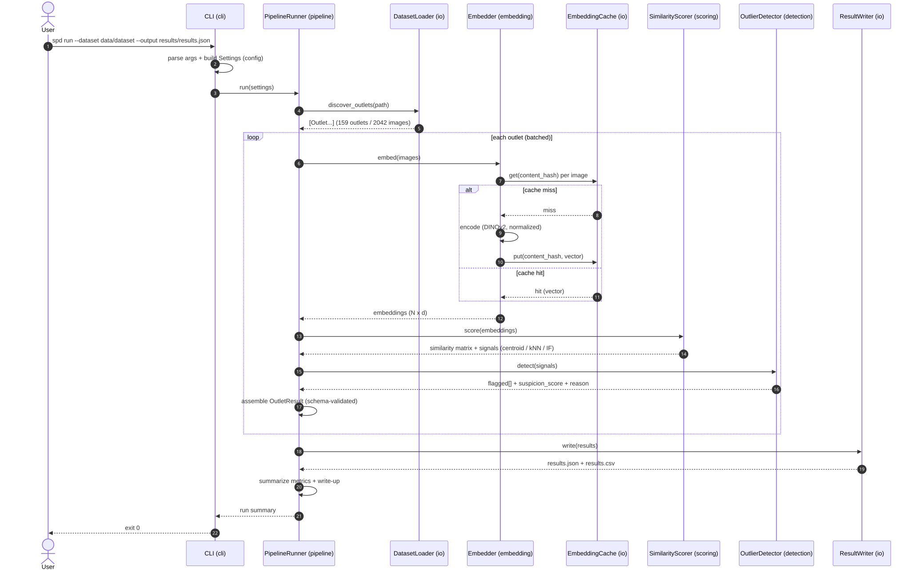

# SYSTEM DESIGN - Suspicious Photo Detection (SPD) - v1

**Suspicious Photo Detection in Outlet Verification Images.**

- **Status:** Design artifact - entity/class diagram + pipeline + sequence diagrams (rendered images).
- **Derived from:** `docs/SPEC.md` §5-§6 (behavior, output schema), §10-§12 (scoring + detection), `docs/ARCHITECTURE.md` §6 (data flow).
- **Source of truth:** `project_docs/Suspicious_Photo_Detection_PRD.pdf`. Where this doc and the PRD/SPEC differ, the PRD wins (SPEC §0).
- **Companion docs:** `docs/SPEC.md`, `docs/ARCHITECTURE.md`, `docs/PLANNING.md`.
- **Diagram sources:** Mermaid `.mmd` files live alongside the images in `docs/assets/` for regeneration.

> This is an unsupervised anomaly-detection pipeline, not a human review system. Outlets are compared to themselves; gradual change is legitimate and only images that stand apart from the outlet's own distribution are flagged.

---

## 1. Entity / Class Diagram

6 core entities - `Outlet`, `ImageRecord`, `Embedding`, `SuspicionProfile`, `OutletResult`, `FlaggedImage` (SPEC §6.2). There is no relational schema: persistence is the embedding cache and the results files.

{ width="100%" }

Mermaid source: `assets/entities.mmd`.

### 1.1 Integrity rules

**Output schema is a hard contract (SPEC §6.1, ED-7)**

- `OutletResult.outlet_id`, `total_images`, `flagged_images`, and optional `ranking` map one-to-one to the PRD "Expected Output Format".
- `FlaggedImage.suspicion_score` MUST be ∈ `[0,1]`, rounded to a fixed precision for stable output.
- `OutletResult.total_images` counts images **evaluated**, not raw file count (§SPEC 5.1).
- Every outlet in the dataset maps to exactly one `OutletResult`; outlets with no flags carry an **empty** `flagged_images` (never omitted).

**Entity relationships**

- `Outlet 1-* ImageRecord`: one folder holds many images; the folder name is `outlet_id`, the file name is `file_name`.
- `ImageRecord 0..1-1 Embedding`: an embedding is produced lazily and cached by content hash; the link is keyed on `content_hash + model + model_version`, not on the file name (same content ⇒ same vector, ED-6).
- `OutletResult 1-0..* FlaggedImage`: only images whose fused score clears the threshold are flagged.
- `FlaggedImage → SuspicionProfile`: the profile (centroid distance, kNN consensus, Isolation Forest score, fused score) explains *why* the image was flagged and feeds the `reason` template (§SPEC 11.4).

**Invariants (property-tested, SPEC §21)**

- `ranking` (when present) covers every image of the outlet; it is a permutation of the outlet's `file_name`s ordered most → least suspicious.
- `flagged_images ⊆ evaluated images`; `len(flagged_images) ≤ total_images`.
- Score direction is fixed: `0` = consistent, `1` = maximally anomalous.

---

## 2. Pipeline Diagram

{ width="100%" }

Mermaid source: `assets/pipeline.mmd`.

Five stages - load → embed → score → detect → report - with two cross-cutting concerns: config (single `settings.py` seam) and observability (structured logs + per-stage timing), and one shared service: the content-addressed embedding cache (§SPEC 13).

---

## 3. Sequence Diagram - single run

{ width="100%" }

Mermaid source: `assets/seq-run.mmd`.

The canonical stage order (SPEC §3, ARCHITECTURE §6.1): **load → embed (with cache) → score → detect → assemble → write → summarize**. The embedding stage consults the cache per image and only encodes on a miss, so a warm cache makes the run essentially free.

---

## 4. Detection Decision Diagram

{ width="100%" }

Mermaid source: `assets/detection.mmd`.

Three signals derived from the cosine-similarity matrix are fused into a single `suspicion_score`, thresholded by `max(median + k·MAD, floor)`, and the survivors become `flagged_images` with a reason; the full score vector becomes `ranking`.

---

## 5. Diagram ↔ Requirement Traceability

| Diagram | FRs | SPEC/ARCH source |
|---|---|---|
| 1 Entity / output schema | FR6, FR7 | §6, §12, ED-7 |
| 2 Pipeline | FR1, FR2, FR10 | §3, §5, ARCH §2/§6 |
| 3 Single-run sequence | FR1-FR6 | ARCH §6.1, §6.2 |
| 4 Detection decision | FR3, FR4, FR5 | §10-§11, ED-4, ED-5 |

---

## 6. Naming & conventions note

Entity/attribute names follow `docs/SPEC.md` §6 vocabulary. Final naming (snake_case, `is_/has_` booleans, enum values) must follow `.agents/skills/coding-rules/naming-conventions/SKILL.md` at implementation time.

**Alignment status:** the model in §1 is canonicalized in `docs/SPEC.md` §6 (output schema), §6.2 (entities), §12 (invariants), and recorded as **ED-7** (§9). `docs/ARCHITECTURE.md` §2 (component map) and §6 (data flow) were authored in the same pass. This document, SPEC §6, and ARCHITECTURE are a single aligned source.
